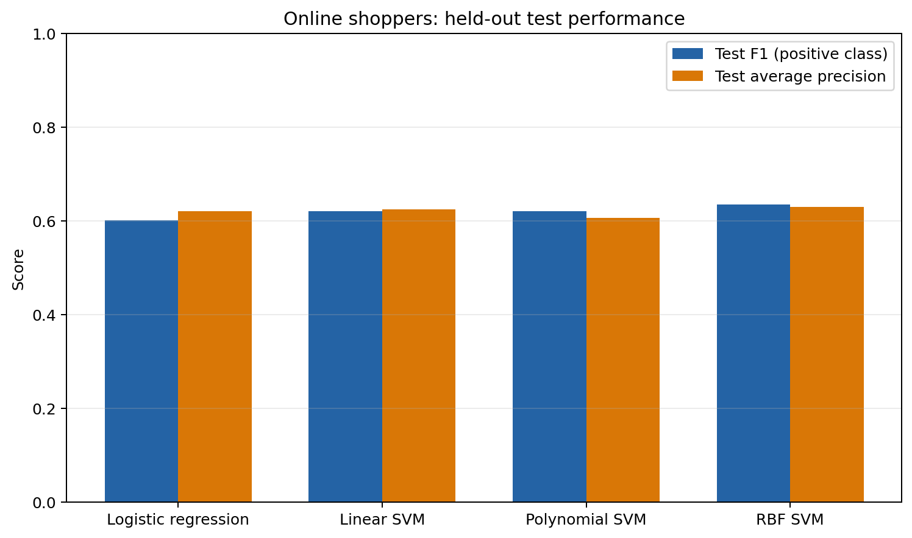
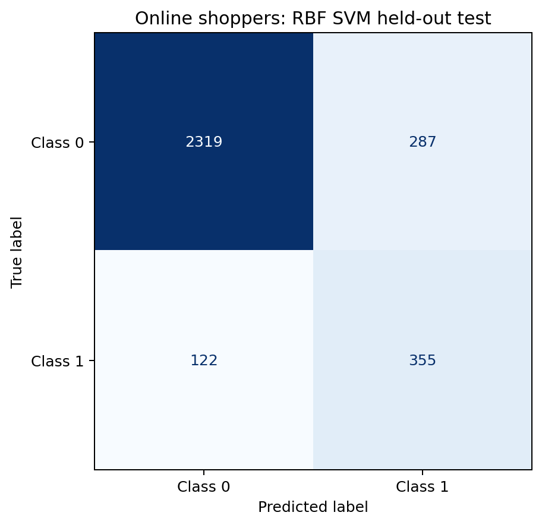
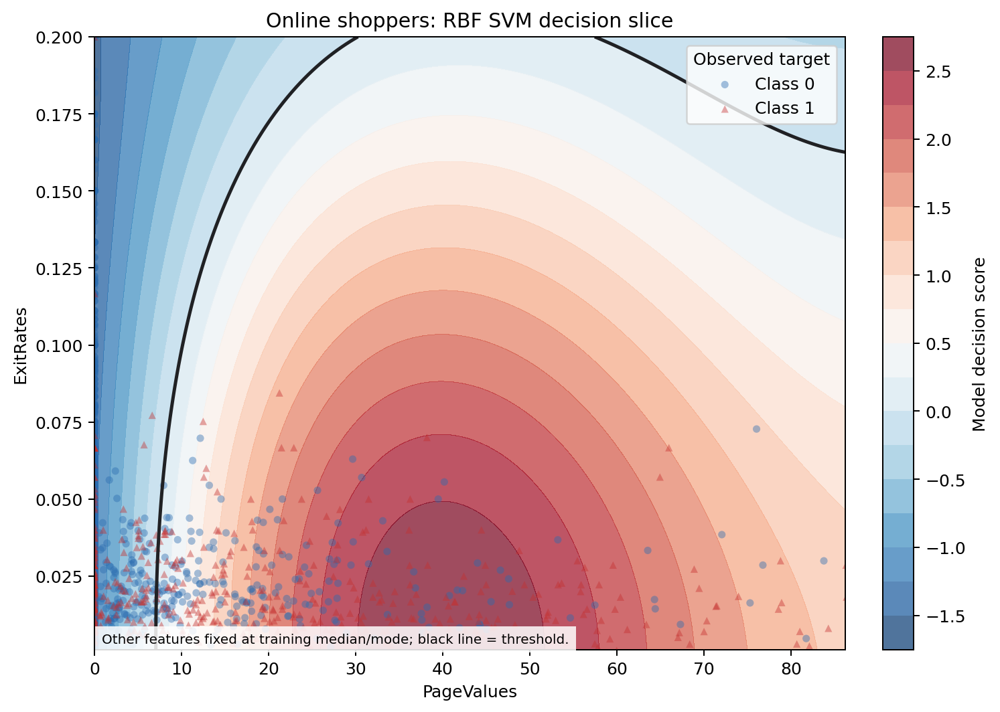
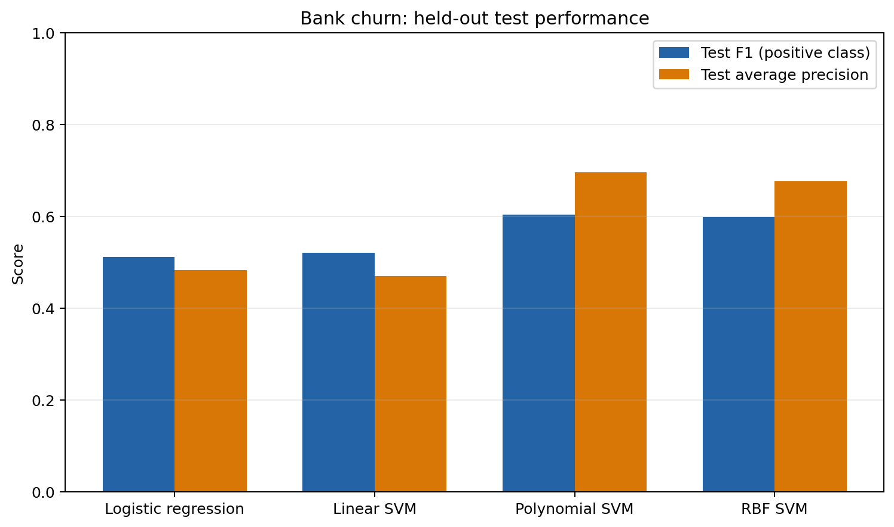
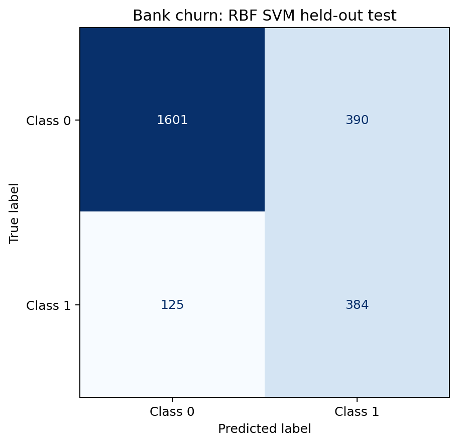
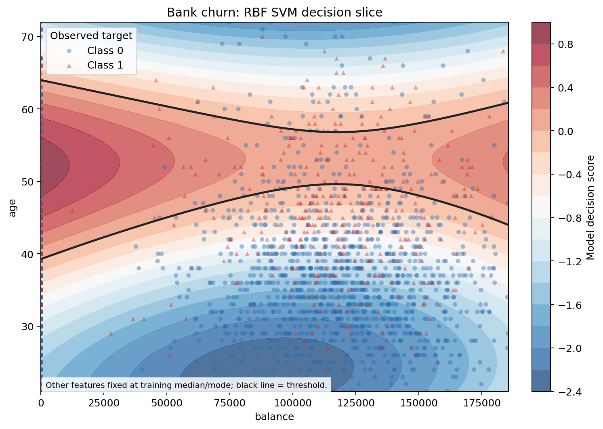

# Customer Behavior Analysis

A reproducible comparison of Logistic Regression and Support Vector Machine (SVM) classifiers for two imbalanced binary-classification problems:

- **Online shoppers:** predict whether a browsing session ends in a purchase.
- **Bank churn:** predict whether a customer leaves the bank.

The project is deliberately structured so that the notebook, CSV metrics, figures, and PDF report all use the same implementation and cannot drift apart.

## Key findings

Model selection is based on three-fold stratified cross-validation on the training data. Final test values below come from a separate, untouched 25% holdout set.

| Dataset | CV-selected model | Test F1, positive class | Test average precision | Test ROC-AUC |
| --- | --- | ---: | ---: | ---: |
| Online shoppers | RBF SVM | 0.634 | 0.630 | 0.894 |
| Bank churn | RBF SVM | 0.599 | 0.676 | 0.859 |

For online shoppers, the linear SVM had the strongest ROC-AUC (0.902), while the RBF SVM had the best cross-validated positive-class F1. For bank churn, polynomial and RBF SVMs substantially outperformed the linear models on the positive class; their held-out F1 scores were 0.603 and 0.599 respectively. The RBF model remains the selected model because it had the strongest cross-validated positive-class F1, rather than because it happened to win a single test split.

These are useful benchmark models, not production-ready decision systems. The positive classes are uncommon--15.5% purchases and 20.4% churn--so accuracy is intentionally not used as the main success measure.

## Figures

Each chart type appears once per dataset, generated by `src/analysis.py` from the same run behind the table above:

- **Model comparison:** test positive-class F1 and average precision side by side, for all four candidate models.
- **Confusion matrix:** counts of correct and incorrect predictions for the selected model (RBF SVM) on the held-out test split.
- **Decision slice:** a two-dimensional view of the selected model's decision boundary for its two most influential features. All other features are fixed at their training median or mode, and the black contour marks the model's decision threshold. This is not causal--it shows what the fitted model does, not what drives purchases or churn.

### Online shoppers



RBF SVM leads on both held-out metrics, though all four models cluster closely on positive-class F1 (0.60-0.63).



Of 477 purchase sessions in the test set, the RBF SVM correctly flags 355 (recall 0.74) at the cost of 287 false positives (precision 0.55).



`PageValues` dominates the decision: sessions with almost any nonzero page value are pushed toward a predicted purchase, while `ExitRates` only matters when `PageValues` is near zero.

### Bank churn



Polynomial and RBF SVMs pull well ahead of the linear models here--average precision jumps from about 0.47-0.48 (logistic regression, linear SVM) to 0.68-0.70 (polynomial, RBF), showing the churn boundary is genuinely nonlinear.



Of 509 churned customers in the test set, the RBF SVM correctly flags 384 (recall 0.75), with 390 false positives (precision 0.50).



`age` is the dominant driver in this slice: predicted churn risk rises sharply in the roughly 45-60 age band across most balances, while younger customers are predicted to stay regardless of balance.

## Repository guide

| Path | Purpose |
| --- | --- |
| `src/analysis.py` | Canonical analysis: loading, preprocessing, model comparison, evaluation, charts, and PDF generation. |
| `assignment7.ipynb` | Minimal notebook entry point that runs the canonical analysis. |
| `online_shoppers_intention.csv` | Online-shopping session data; target column: `Revenue`. |
| `Bank Customer Churn Prediction.csv` | Bank customer data; target column: `churn`. |
| `results/` | Generated metric tables and machine-readable run summary. |
| `figures/` | Generated model comparisons, confusion matrices, and decision slices. |
| `Project 7 - Logistic Regression and SVMs.pdf` | Generated visual report based on the same run. |

## Run the analysis

Requires Python 3. The pinned dependency versions are in `requirements.txt`.

```bash
python -m venv .venv
.venv/bin/pip install -r requirements.txt
.venv/bin/python src/analysis.py
```

This regenerates `results/`, `figures/`, and the PDF report. To run it interactively, open `assignment7.ipynb` from the repository root and execute its single code cell.

## Methodology

1. Split each dataset into 75% training and 25% test data with stratification and `random_state=42`.
2. Fit preprocessing only within training folds by using scikit-learn pipelines.
3. Standardize continuous columns and one-hot encode categorical columns. In the shopping data, browser, region, operating-system, and traffic-source integer codes are treated as nominal categories rather than ordered values. `customer_id` is excluded from the churn model.
4. Compare balanced Logistic Regression, linear SVM, degree-three polynomial SVM, and RBF SVM classifiers. `class_weight="balanced"` is the shared, reproducible imbalance baseline.
5. Select the leading model with three-fold stratified cross-validation on a 1,000-row stratified training sample, then evaluate every model once on the untouched test set.

The generated metric tables report cross-validation F1 (including its standard deviation), held-out positive-class F1, average precision, and ROC-AUC. Positive-class F1 measures the balance of precision and recall for purchase/churn; average precision summarizes the precision-recall curve; ROC-AUC summarizes ranking ability across thresholds.

## Data notes and limitations

- The shopper dataset contains 125 exact duplicate rows. They are retained and reported to preserve the supplied dataset; assess them against the source before production use.
- This project is a model comparison, not causal analysis. Feature effects in a decision slice must not be interpreted as causal effects.
- The 1,000-row CV sample keeps the workflow quick to rerun. For a higher-stakes model, expand validation, tune hyperparameters using nested cross-validation, assess calibration and subgroup performance, and define a business-specific decision threshold.

## Data sources

- [Online Shoppers Purchasing Intention](https://www.kaggle.com/datasets/imakash3011/online-shoppers-purchasing-intention-dataset)
- [Bank Customer Churn](https://www.kaggle.com/datasets/gauravtopre/bank-customer-churn-dataset)
